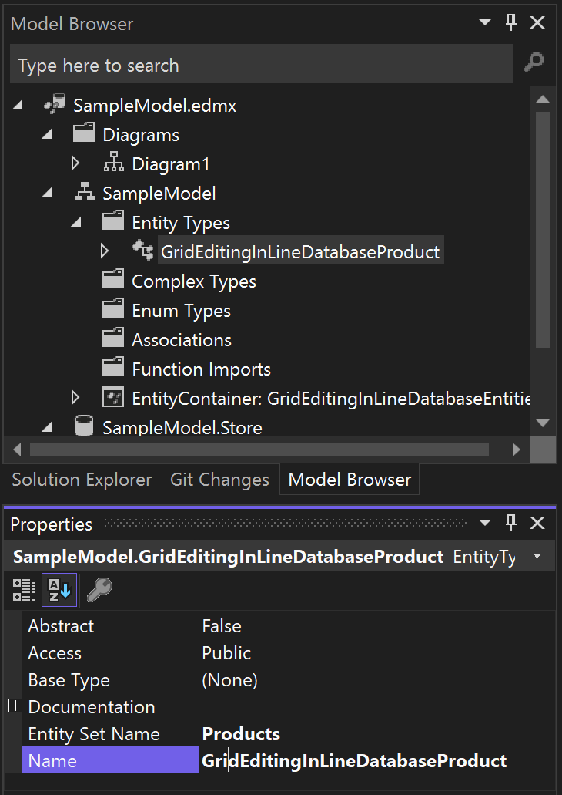

UI for ASP.NET MVC Examples
==========================

This repo contains a collection of Telerik UI for ASP.NET MVC examples. They are located in the Area folder of the project for convenience to the user. The provided samples:

- Demonstrate frequently asked questions, features, and scenarios.
- Are not part of our testing procedures and should be regarded as a knowledge base. 
- Might contain custom implementations which can be changed or integrated built-in with future release versions of the Product.

**DISCLAIMER: The Telerik.Examples.Mvc project is created only for demonstration purpose of the code samples and syntax. Its references, external packages and current versions should not be used in production and we don't claim responsibility for any package security.**

To run projects from this repository:

1. Clone the repo.
2. Open the Telerik.Examples.Mvc.sln file in Visual Studio.
3. Clean the solution.
4. Restore any missing NuGet packages.
5. Build the solution and run the project.

## Adding New Examples

To add a new sample, you can 

1. Create a new Area which will contain all the necessary files. The Naming of the sample should follow this logic:


2. Delete the web.config file and Views/Shared folder as they are optional.
3. Alternatively, you can copy another working Area and do mass-renaming.
4. It is important to apply namespaces to the Controllers and Models of the example so the classes do not become ambiguous, e.g.  Telerik.Examples.Mvc.Areas.GridSelectionByField.Models
5. If you are adding an example with database, ensure that you change the EF model class names, but not the collection names:



And then you can add new Entity definition to the Web.config like this:

```
	  <add name="GridEditingInLineDatabaseEntities" connectionString="metadata=res://*/Areas.GridEditingInLineDatabase.Models.SampleModel.csdl|res://*/Areas.GridEditingInLineDatabase.Models.SampleModel.ssdl|res://*/Areas.GridEditingInLineDatabase.Models.SampleModel.msl;provider=System.Data.SqlClient;provider connection string='Data Source=(LocalDB)\MSSQLLocalDB;attachdbfilename=|DataDirectory|\Sample.mdf;integrated security=True;connect timeout=30;MultipleActiveResultSets=True;App=EntityFramework'" providerName="System.Data.EntityClient" />

```